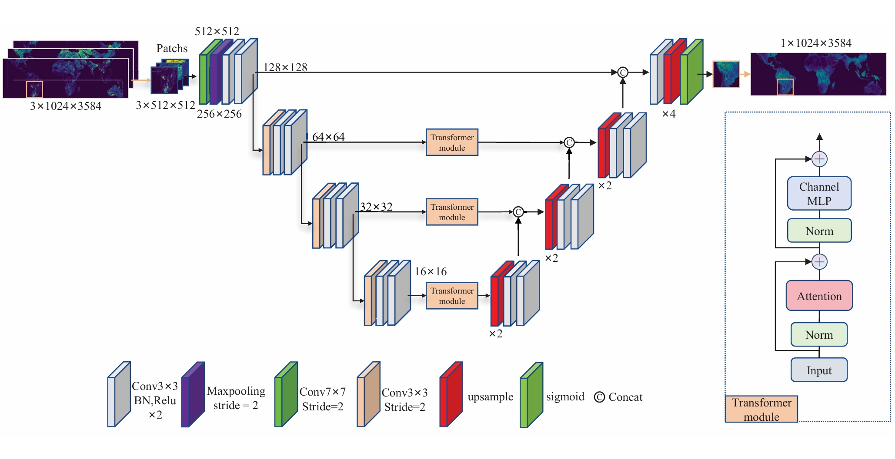

# SMViT
This is the official pytorch implementation of [A Modified Hierarchical Vision Transformer for  Soil Moisture  Retrieval From CyGNSS Data] (Water Resources Research). 

The current version supports Python>=3.10, CUDA>=11.8.0 and PyTorch>=2.0, but it should work fine with lower versions of CUDA and PyTorch. 



## Introduction
This research introduces a new deep learning (DL) framework, multi-head self-attention-aided vision transformer (MSA-ViT), for soil moisture (SM) retrieval using Cyclone Global Navigation Satellite System (CyGNSS) data. The study began by assessing the sensitivity of CyGNSS reflectivity data to SM, showing a high correlation between them. Using data from January 2020 to December 2024, we aggregated observations over multiple temporal scales (360 days) to capture diverse hydrological patterns. The MSA-ViT model was initially trained using 10-day averaged data and subsequently tested across varying temporal scales to confirm its ability to reflect SM dynamics. Comparative experiments with conventional techniques such as linear regression and shallow neural networks, alongside other established DL models, demonstrated the outperformance of the proposed MSA-ViT-based approach. Following the initial validation, the training dataset was expanded with a broader range of temporal patterns to enhance the model’s generalization capabilities. Further evaluation was conducted through time series analysis, comparing the model’s 3-day retrievals with the SMAP data, the CyGNSS L3 Soil Moisture V3.2 product, the in-situ International Soil Moisture Network measurements and the Global Precipitation Measurement (GPM) records, which showed consistent alignment with SMAP SMs and clear seasonal variability. Results also demonstrate improvement over the current CyGNSS L3 product on both precision and coverage. This comprehensive validation across large watersheds and diverse spatiotemporal scales attests to the model’s robustness and its applicability for different ecosystem types.

## Citation

If you use MSA-ViT in an academic work, please cite:

```
@article{Yan2025,
  title={A Modified Hierarchical Vision Transformer for  Soil Moisture  Retrieval From CyGNSS Data},
  author={Yan, Qingyun and Chen, Yuhan and Pan, Yuanjin and Jin, Shuanggen and Huang, Weimin},
  journal={Water Resources Research},
  year={2025},
  publisher={AGU}
}
``` -->
